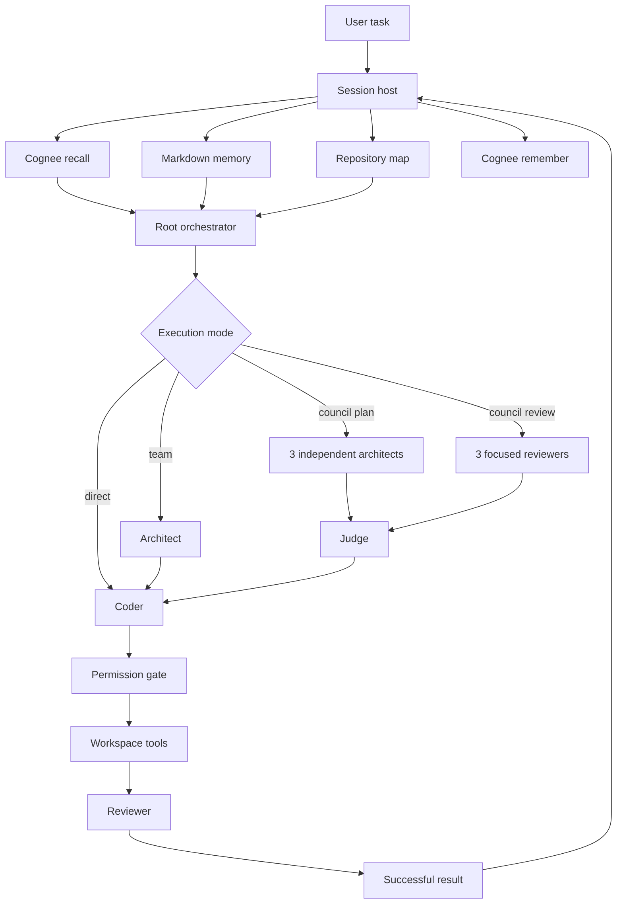

<div align="center">
  <h1>Jevio</h1>
  <h3>A local-first coding agent that remembers how your project works</h3>
  <p>
    Jevio routes software tasks across specialized models, keeps every side effect<br>
    behind a permission gate, and uses Cognee to carry useful project knowledge across sessions.
  </p>
  <p>
    <a href="https://nodejs.org/"></a>
    <a href="https://www.cognee.ai/"></a>
    <a href="#testing"></a>
    <a href="LICENSE"></a>
  </p>
  <p><strong>Local models · cloud models · durable memory · multi-agent review · readable sessions</strong></p>
</div>

> **Hackathon project:** Jevio was built for *The Hangover Part AI: Where's My
> Context?* Cognee is part of Jevio's model runtime—not a Codex dependency—and
> implements the complete `remember → recall → improve → forget` lifecycle.

<details>
<summary><strong>Коротко по-русски</strong></summary>

Jevio — локальный coding agent и оркестратор моделей. Он распределяет задачи
между architect, coder, reviewer и judge, сохраняет читаемые Markdown-сессии и
использует Cognee как семантическую память проекта. Перед каждой задачей модель
получает релевантные прошлые решения, а после успешной работы краткий результат
сохраняется в память без служебного tool trace.

</details>

## Why Jevio?

Most coding agents lose project knowledge when a chat ends. Large transcripts
are expensive to replay, raw tool logs pollute context, and simply giving more
models write access creates conflicts instead of better code.

Jevio separates those concerns:

| Problem | Jevio's approach |
| --- | --- |
| Decisions disappear between sessions | Project-scoped semantic memory with Cognee |
| Long chats overflow the context window | Model-driven compaction with readable checkpoints |
| Multiple agents overwrite each other | Read-only parallel analysis, one controlled writer |
| Models waste tokens discovering the repository | Cached symbol index and bounded repository map |
| Tool use can escape the intended scope | Host-side workspace guard and permission gates |
| Agent history is hard to inspect | Plain Markdown transcripts in `.jevio/sessions/` |

## What works today

- Interactive terminal UI with streaming reasoning and tool activity.
- One-shot tasks and resumable, forkable Markdown sessions.
- Separate models for orchestrator, architect, coder, reviewer, judge, and compactor.
- Direct, orchestrated, team, council-plan, and council-review execution modes.
- OpenAI-compatible Chat Completions and Responses transports.
- Ollama, LM Studio, vLLM, OpenRouter, NVIDIA, OpenAI, and compatible endpoints.
- Workspace tools for reading, searching, editing, shell commands, and Git diff.
- Agent Skills discovery from `.agents/skills/*/SKILL.md`.
- Built-in symbol navigation with optional Universal Ctags acceleration.
- Durable Markdown memory plus optional Cognee semantic recall.
- Explicit approval for plans, file writes, and shell execution.

## How it works



The model is never the security boundary. File access, writes, shell commands,
delegation, and workspace containment are enforced by the host.

## Cognee memory lifecycle

Cognee is the semantic layer above Jevio's inspectable Markdown memory. The
current task and repository state always outrank retrieved history.

| Stage | When it runs | What Jevio does |
| --- | --- | --- |
| **Remember** | After a successful task, explicit memory entry, or compaction | Stores concise Markdown without tool traces |
| **Recall** | Before every task | Retrieves dataset-scoped context and marks it as untrusted history |
| **Improve** | On `/memory improve` | Enriches the existing graph; falls back to legacy `memify` when needed |
| **Forget** | On confirmed `/memory clear` | Deletes only this project's Cognee dataset |

Memory is intentionally fail-open. A timeout, missing credential, or unavailable
Cognee service produces a warning but does not stop the coding task or prevent
the local session from being saved.

### Memory boundaries

- `.jevio/MEMORY.md` contains user-maintained project instructions.
- `.jevio/sessions/*.md` contains readable user/assistant transcripts.
- Cognee stores semantic project history in a dedicated dataset.
- Retrieved memory is data, never an instruction.
- API keys remain in environment variables or ignored local secret files.

## Quick start

### Requirements

- Node.js 22.19 or newer
- Git
- At least one OpenAI-compatible model endpoint

### Install

```bash
git clone https://github.com/theJorDea/JevioFuseHack.git
cd JevioFuseHack
npm ci
```

Run the interactive setup wizard:

```bash
node src/cli.ts setup
node src/cli.ts doctor
```

Start an interactive session:

```bash
node src/cli.ts
```

Or run one task directly:

```bash
node src/cli.ts "add tests for the configuration parser"
```

To install the `jevio` command globally from the cloned repository:

```bash
npm install -g .
jevio doctor
```

## Configure a model provider

Jevio ships with an Ollama-oriented example. Any OpenAI-compatible endpoint can
be configured in `jevio.config.json`:

```json
{
  "defaultProvider": "cloud",
  "providers": {
    "cloud": {
      "baseUrl": "https://api.example.com/v1",
      "apiKeyEnv": "MY_LLM_API_KEY",
      "defaultModel": "my-code-model"
    }
  },
  "roles": {
    "orchestrator": { "provider": "cloud", "model": "my-code-model" },
    "coder": { "provider": "cloud", "model": "my-code-model" },
    "architect": { "provider": "cloud", "model": "my-code-model" },
    "reviewer": { "provider": "cloud", "model": "my-code-model" },
    "judge": { "provider": "cloud", "model": "my-code-model" },
    "compactor": { "provider": "cloud", "model": "my-code-model" }
  }
}
```

Different roles may use different providers and models. Direct API keys are not
required in the tracked configuration.

## Configure Cognee

For Cognee Cloud, set the endpoint and key in the environment.

PowerShell:

```powershell
$env:COGNEE_BASE_URL = "https://your-tenant.cognee.ai"
$env:COGNEE_API_KEY = "your-api-key"
```

Bash or zsh:

```bash
export COGNEE_BASE_URL="https://your-tenant.cognee.ai"
export COGNEE_API_KEY="your-api-key"
```

Then enable the adapter:

```json
{
  "memory": {
    "cognee": {
      "enabled": true,
      "baseUrl": "http://localhost:8000",
      "baseUrlEnv": "COGNEE_BASE_URL",
      "apiKeyEnv": "COGNEE_API_KEY",
      "authMode": "x-api-key",
      "dataset": "agent_sessions",
      "timeoutMs": 60000,
      "maxResults": 6,
      "maxContextCharacters": 8000,
      "maxRememberCharacters": 16000,
      "rememberCompletedTurns": true,
      "rememberCompactions": true
    }
  }
}
```

For self-hosted Cognee, use its local URL directly. If authentication is enabled,
set `authMode` to `bearer` and provide the token through `apiKeyEnv`.

## Two-minute hackathon demo

1. Run `node src/cli.ts doctor` and show the connected Cognee dataset.
2. Start Jevio and complete a small repository task.
3. Run `/memory status` until the pipeline reports
   `DATASET_PROCESSING_COMPLETED`.
4. Start a new session with `/new` and ask a related task.
5. Show the `recalled relevant Cognee memory` event and the better contextual answer.
6. Run `/memory improve` to demonstrate graph enrichment.
7. Optionally use `/memory clear` to demonstrate dataset-scoped deletion.

This proves that memory survives the chat boundary while current code still
remains the source of truth.

## Execution modes

| Mode | Pipeline | Best for |
| --- | --- | --- |
| `--direct` | coder | Small, obvious changes with minimum latency |
| default | orchestrator with dynamic delegation | General work |
| `--team` | architect → coder → reviewer | Changes that need a mandatory design and review pass |
| `--council-plan` | 3 architects → judge → coder → reviewer | Risky architectural decisions |
| `--council-review` | 3 focused reviewers → judge | Independent security, correctness, and test review |

Examples:

```bash
node src/cli.ts --direct "rename the parser helper"
node src/cli.ts --team "refactor the session storage layer"
node src/cli.ts --council-plan "redesign provider routing"
node src/cli.ts --council-review
```

Council modes parallelize read-only reasoning. Only one coder receives write
access, preventing conflicting edits.

## Interactive commands

### Sessions

```text
/new                  Start a new session
/sessions             List and switch sessions
/resume [id]          Resume a session
/title <text>         Rename the current session
/fork                 Fork the conversation
/export-md [path]     Export a Markdown transcript
```

### Memory and context

```text
/memory               Show Markdown project memory
/memory add <text>    Add an explicit durable instruction
/memory status        Check Cognee connection, dataset, and pipeline
/memory sync          Upload MEMORY.md to Cognee
/memory improve       Enrich the Cognee graph
/memory clear         Clear Markdown memory and this project's dataset
/compact [note]       Compact the current context
/compact status       Show context and compaction settings
```

### Agent modes

```text
/direct
/orchestrate
/team
/council-plan
/council-review
```

## Context management

Jevio keeps long sessions usable without hiding their history:

- The full transcript stays in Markdown.
- Compaction creates a continuation summary with a dedicated model role.
- Recent exact messages are retained after the summary.
- Large and old tool outputs are pruned from model-visible context.
- Static memory, skills, repository map, and the next task count toward the limit.
- Resume starts from the latest checkpoint instead of replaying every tool call.

## Safety model

- Paths are resolved against the workspace and checked against traversal.
- Symlinks cannot be used to escape the workspace boundary.
- Writes and shell commands require approval by default.
- Architect and reviewer roles do not receive mutation tools.
- Shell permissions support `off`, `tests-only`, `package-manager`, and `full`.
- Plans for implementation tasks are persisted and require approval.
- Cognee failures never block local session persistence.
- Retrieved historical memory is explicitly prompt-injection resistant.

`--yes` and automatic approvals are intended only for repositories you trust.

## Testing

Run the offline suite:

```bash
npm test
npm run check
```

Run the opt-in real Cognee Cloud lifecycle test:

```bash
npm run test:cloud
```

The Cloud test creates an isolated temporary dataset, waits for indexing, verifies
recall and improve, and deletes the dataset in cleanup.

## Project structure

```text
bin/                         CLI launcher
src/agent.ts                 Stateless model/tool loop
src/cli.ts                   Session host and interactive commands
src/orchestrator.ts          Team and council pipelines
src/memory.ts                Cognee REST adapter
src/session.ts               Markdown session persistence
src/compaction.ts            Long-context compaction
src/symbol-index.ts          Repository map and symbol lookup
src/tools.ts                 Workspace tools and permission gates
src/provider/                Model transport adapters
src/default-skills/          Bundled Agent Skills
test/                        Unit and Cloud integration tests
docs/architecture.md         Detailed architecture and invariants
```

For implementation details and design invariants, see
[docs/architecture.md](docs/architecture.md).

## Roadmap

- Retrieval feedback and memory quality scoring.
- A compact benchmark for coding decisions, workflows, and stale-memory handling.
- MCP client and dynamic tool schemas.
- Provider capability registry for vision, reasoning, and context size.
- Editor integration through ACP.
- More precise tokenizer-aware context accounting.

## Design influences

Jevio takes architectural inspiration from
[Kimi Code](https://github.com/MoonshotAI/kimi-code) for isolated agent contexts
and readable sessions, and from [OpenCode](https://github.com/anomalyco/opencode)
for context hygiene. Its semantic memory layer is powered by
[Cognee](https://github.com/topoteretes/cognee).

No source code from those projects is copied into Jevio.

## License

[MIT](LICENSE)
