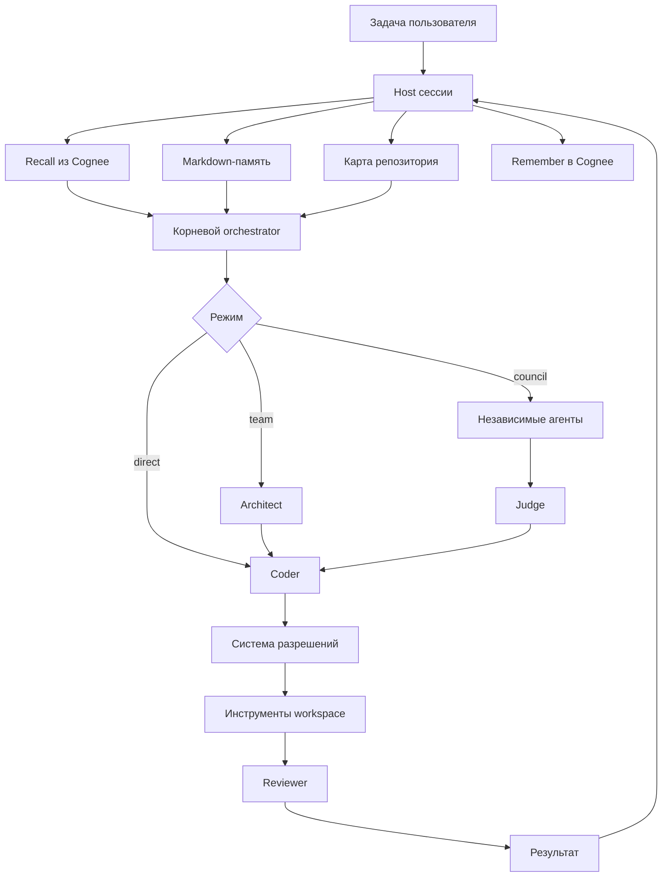

<div align="center">
  <h1>Jevio Fuse</h1>
  <h3>Локальный coding-агент, который помнит устройство вашего проекта</h3>
  <p>Jevio распределяет задачи между специализированными моделями, контролирует изменения<br>через систему разрешений и сохраняет знания с помощью Cognee.</p>
  <p>
    <a href="https://nodejs.org/"></a>
    <a href="https://www.cognee.ai/"></a>
    <a href="#тестирование"></a>
    <a href="LICENSE"></a>
  </p>
  <p><strong>Локальные и облачные модели · долговременная память · мультиагентное ревью · читаемые сессии</strong></p>
</div>

> **Проект для хакатона:** Jevio создан для *The Hangover Part AI: Where's My
> Context?*. Cognee входит в runtime Jevio и реализует полный цикл памяти
> `remember → recall → improve → forget`.

## Зачем нужен Jevio

Большинство coding-агентов теряют знания о проекте после завершения чата.
Длинные диалоги дорого передавать повторно, логи инструментов загрязняют
контекст, а несколько моделей с правом записи создают конфликты.

| Проблема | Решение Jevio |
| --- | --- |
| Решения исчезают между сессиями | Семантическая память Cognee на уровне проекта |
| Диалог переполняет контекст | Компактизация с читаемыми checkpoint-записями |
| Агенты конфликтуют при записи | Параллельный read-only анализ и один writer |
| Модели повторно изучают код | Кэшируемый индекс символов и карта репозитория |
| Инструменты выходят за границы | Проверка workspace и система разрешений host |
| Историю трудно проверить | Markdown-транскрипты в `.jevio/sessions/` |

## Что уже работает

- Интерактивный TUI со streaming-выводом рассуждений и действий.
- Веб-интерфейс с потоковым чатом, историей сессий и настройками провайдера/модели.
- Возобновляемые и разветвляемые Markdown-сессии.
- Роли orchestrator, architect, coder, reviewer, judge и compactor.
- Режимы direct, orchestrate, team, council-plan и council-review.
- OpenAI-совместимые Chat Completions и Responses transports.
- Ollama, LM Studio, vLLM, OpenRouter, NVIDIA, OpenAI и совместимые API.
- Чтение, поиск, редактирование, shell-команды и просмотр Git diff.
- Agent Skills из `.agents/skills/*/SKILL.md`.
- Индекс символов с опциональным ускорением Universal Ctags.
- Markdown-память и семантический recall через Cognee.
- Явное подтверждение планов, записи файлов и shell-команд.

## Как это устроено



Модель не является границей безопасности. Файлы, запись, shell-команды,
делегирование и границы workspace контролирует host.

## Жизненный цикл памяти Cognee

Cognee — семантический слой поверх проверяемой Markdown-памяти. Текущая задача
и состояние репозитория всегда приоритетнее извлечённой истории.

| Этап | Когда | Действие |
| --- | --- | --- |
| **Remember** | После успешной задачи, явной записи или компактизации | Сохраняет краткий Markdown с проверяемым provenance без tool trace |
| **Recall** | Перед задачей | Извлекает контекст из dataset проекта как недоверенную историю |
| **Improve** | По `/memory improve` или при создании новой Web-сессии | Переносит session cache в граф; поддерживает legacy `memify` |
| **Forget** | После `/memory clear` | Удаляет только dataset текущего проекта |

Сбой Cognee приводит к предупреждению, но не останавливает задачу и сохранение
локальной сессии.

CLI и Web UI используют один lifecycle: каждый успешный turn сохраняется с ID
активной сессии и provenance, а Web UI при переходе к новой сессии запускает
фоновый session-to-graph bridge для предыдущего разговора.

### Границы памяти

- `.jevio/MEMORY.md` — пользовательские инструкции проекта.
- `.jevio/memory-log.jsonl` — локальный журнал источников и проверок памяти.
- `.jevio/project.json` — стабильный ID проекта и закреплённое имя dataset.
- `.jevio/sessions/*.md` — читаемые диалоги.
- Cognee — семантическая история в отдельном dataset.
- Извлечённая память считается данными, а не инструкцией.
- API-ключи хранятся в окружении или игнорируемых локальных файлах.

## Быстрый старт

Требуются Node.js 22.19+, Git и OpenAI-совместимый endpoint модели.

```bash
git clone https://github.com/theJorDea/JevioFuseHack.git
cd JevioFuseHack
npm ci
node src/cli.ts setup
node src/cli.ts doctor
node src/cli.ts
```

Одноразовая задача и глобальная установка:

```bash
node src/cli.ts "добавь тесты для парсера конфигурации"
npm install -g .
jevio doctor
```

## Веб-интерфейс

Запустите локальный веб-клиент из корня проекта:

```bash
npm run web
```

По умолчанию интерфейс доступен по адресу `http://127.0.0.1:8787` и открывается
в браузере автоматически. Если браузер нужно открыть вручную:

```bash
node src/cli.ts web --no-open
```

В веб-версии доступны:

- потоковые ответы и события выполнения через SSE;
- явная остановка текущего запуска с отменой запроса к модели;
- восстановление истории текущей сессии после перезагрузки страницы;
- создание, просмотр и переключение Markdown-сессий;
- режимы `orchestrate`, `direct`, `plan`, `team`, `council-plan` и `council-review`;
- подтверждения действий, вопросы агента и переключатель YOLO;
- выбор провайдера и модели прямо из панели настроек.

Параметры сервера:

```bash
node src/cli.ts web --port 8787 --host 127.0.0.1 --no-open
```

Не включайте `--yes`/`--yolo` для недоверенных проектов: этот режим автоматически
подтверждает запись файлов, shell-команды и действия плагинов.

## Настройка провайдера модели

В репозитории есть пример для Ollama. Любой OpenAI-совместимый endpoint можно
указать в `jevio.config.json`:

```json
{
  "defaultProvider": "cloud",
  "providers": {
    "cloud": {
      "baseUrl": "https://api.example.com/v1",
      "apiKeyEnv": "MY_LLM_API_KEY",
      "defaultModel": "my-code-model"
    }
  },
  "roles": {
    "orchestrator": { "provider": "cloud", "model": "my-code-model" },
    "coder": { "provider": "cloud", "model": "my-code-model" },
    "architect": { "provider": "cloud", "model": "my-code-model" },
    "reviewer": { "provider": "cloud", "model": "my-code-model" },
    "judge": { "provider": "cloud", "model": "my-code-model" },
    "compactor": { "provider": "cloud", "model": "my-code-model" }
  }
}
```

Для разных ролей можно выбрать разные модели и провайдеры. Секреты не нужно
записывать в отслеживаемую Git-конфигурацию.

## Как пользоваться Cognee

Cognee необязателен: без него Jevio продолжает хранить локальные Markdown-сессии
и `.jevio/MEMORY.md`. После включения Cognee добавляет семантический поиск по
прошлым решениям и переносит полезный контекст между сессиями.

### Вариант 1: Cognee Cloud

1. Создайте аккаунт в [Cognee Cloud](https://platform.cognee.ai/) и выпустите
   API-ключ.
2. Сохраните URL сервиса и ключ в переменных окружения. Не записывайте ключ в
   `jevio.config.json`.

PowerShell:

```powershell
$env:COGNEE_BASE_URL = "https://api.cognee.ai"
$env:COGNEE_API_KEY = "your-api-key"
$env:COGNEE_TENANT_ID = "your-tenant-id"
```

Bash или zsh:

```bash
export COGNEE_BASE_URL="https://api.cognee.ai"
export COGNEE_API_KEY="your-api-key"
export COGNEE_TENANT_ID="your-tenant-id"
```

Если в личном кабинете указан tenant-specific URL, используйте его вместо
`https://api.cognee.ai`.

Эти значения задаются один раз на сервере Jevio, а не у каждого пользователя и
не в браузере. Cognee здесь является общей backend-службой памяти: Jevio передаёт
ей project ID и session ID от имени пользователей приложения. Dataset проекта
может хранить общие технические решения команды, а session cache — контекст
отдельных разговоров.

Важно: session ID разделяет контекст, но сам по себе не является авторизацией.
Текущий Web host рассчитан на один workspace и не является готовой публичной
multi-tenant границей. Для общего сервиса нужно добавить аутентификацию
приложения, выдавать session ID только на backend и проверять доступ пользователя
к project ID. Личную память следует хранить в user-scoped dataset, а общие знания
проекта — в project-scoped dataset.

### Вариант 2: локальный Cognee через Docker

Создайте файл `.env` с ключом LLM-провайдера, который Cognee будет использовать
для построения графа. `.env` уже добавлен в `.gitignore`.

```dotenv
LLM_API_KEY=your-llm-api-key
```

Запустите Cognee:

```bash
docker run --env-file ./.env -p 8000:8000 --rm -it cognee/cognee:main
```

После запуска API доступен по `http://localhost:8000`, а Swagger — по
`http://localhost:8000/docs`. Локальная установка обычно работает без
аутентификации. Если она включена, получите токен Cognee и используйте режим
`bearer`.

### Подключение Cognee к Jevio

Добавьте раздел `memory` в `jevio.config.json`.

Для Cognee Cloud:

```json
{
  "memory": {
    "cognee": {
      "enabled": true,
      "baseUrl": "http://localhost:8000",
      "baseUrlEnv": "COGNEE_BASE_URL",
      "apiKeyEnv": "COGNEE_API_KEY",
      "tenantIdEnv": "COGNEE_TENANT_ID",
      "authMode": "x-api-key",
      "timeoutMs": 60000,
      "maxResults": 6,
      "maxContextCharacters": 8000,
      "maxRememberCharacters": 16000,
      "sessionAware": true,
      "rememberCompletedTurns": true,
      "rememberCompactions": true
    }
  }
}
```

Значение из `COGNEE_BASE_URL` имеет приоритет над `baseUrl`. Для локального
Cognee достаточно убрать `baseUrlEnv`, `apiKeyEnv` и `tenantIdEnv`, оставив
`baseUrl: "http://localhost:8000"`.

Если поле `dataset` не задано, при первом запуске Jevio вычисляет совместимое с
предыдущими версиями имя из пути workspace и сохраняет его вместе со случайным
project ID в `.jevio/project.json`. После переноса или переименования папки Jevio
читает этот файл и продолжает использовать прежний dataset. Это рекомендуемый
вариант: знания проектов не смешиваются и не теряются при перемещении каталога.

`.jevio/project.json` содержит только идентификаторы, но остаётся локальным и уже
добавлен в `.gitignore`. Для намеренного общего графа команды задайте явный
`dataset` — он имеет приоритет над project identity:

```json
{
  "memory": {
    "cognee": {
      "dataset": "shared-team-memory"
    }
  }
}
```

### Проверка подключения

Сначала запустите диагностику:

```bash
node src/cli.ts doctor
```

Команда показывает стабильный project ID. Для включённого Cognee она также
показывает URL, dataset и состояние pipeline. В интерактивной сессии ту же
проверку выполняет:

```text
/memory status
```

При первой настройке сообщение `dataset not created yet` нормально: dataset
появится после первой записи. После выполнения задачи дождитесь статуса
`DATASET_PROCESSING_COMPLETED`, прежде чем проверять recall новых данных.

### Повседневное использование

Cognee работает автоматически. Запускайте Jevio как обычно:

```bash
node src/cli.ts
```

Затем выполните задачу, например:

```text
Запомни принятое архитектурное решение и добавь тест для нового поведения
```

После успешного ответа Jevio сохранит в Cognee исходный запрос и итог без сырого
tool trace. В новой сессии задайте связанную задачу:

```text
/new
Какое архитектурное решение мы приняли в прошлой задаче и как его продолжить?
```

Перед вызовом модели Jevio выполнит semantic recall. При найденном контексте в
потоке событий появится `recalled relevant Cognee memory`.

Команды управления памятью:

| Команда | Что делает |
| --- | --- |
| `/memory` | Показывает локальный `.jevio/MEMORY.md` |
| `/memory add <текст>` | Добавляет явную долговременную запись и синхронизирует её с Cognee |
| `/memory replace <record-id> <текст>` | Заменяет устаревшую запись и связывает provenance через `supersedes` |
| `/memory status` | Проверяет API, dataset и статус обработки |
| `/memory explain` | Показывает последний recall и provenance недавних записей |
| `/memory sync` | Загружает текущее содержимое `MEMORY.md` в Cognee |
| `/memory improve` | Обогащает граф и переносит память активной сессии |
| `/memory clear` | После подтверждения очищает Markdown-память и dataset этого проекта |

Пример ручной записи:

```text
/memory add Для новых CLI-команд всегда добавляем unit-тесты и обновляем README
/memory replace 7d91a2 Старый timeout больше не используется; актуальное значение — 60 секунд
```

После серии записей можно запустить:

```text
/memory improve
```

### Как Cognee работает внутри Jevio

1. **Перед задачей** Jevio сначала ищет контекст в памяти активной сессии, затем
   выполняет `/api/v1/recall` по dataset текущего проекта.
2. **Session и graph результаты** объединяются, обрезаются по `maxResults` и
   `maxContextCharacters`, дедуплицируются и помечаются как недоверенная история.
3. **Модель получает память** вместе с текущим кодом, но актуальный repository
   state и новая задача всегда имеют более высокий приоритет.
4. **После успешной задачи** host фиксирует ID проекта и записи, время, session
   ID, repository HEAD, изменённые пути и реальные test-команды с exit code в
   `.jevio/memory-log.jsonl`.
5. **В Cognee** Jevio отправляет краткий Markdown с этим provenance и ID активной
   сессии, если включён `rememberCompletedTurns`.
6. **При компактизации** checkpoint также записывается в Cognee, если включён
   `rememberCompactions`.
7. **По `/memory improve`** Cognee переносит полезные данные активной сессии в
   постоянный граф и обогащает его для последующего retrieval.
8. **По `/memory clear`** Jevio очищает локальный журнал, находит dataset по имени
   и удаляет только его, не затрагивая память других проектов.

Команда `/memory explain` не просит модель объяснять саму себя. Она показывает
наблюдаемые host-данные: запрос и время recall, источник каждого фрагмента,
dataset, session ID, доступные score/timestamp, Git HEAD, dirty paths и результаты
test-команд. Модель по-прежнему получает только ограниченный текстовый контекст.
Заменённые записи отмечаются как `superseded by`, а новые показывают список
`supersedes`. Перед передачей модели host удаляет tombstone-строки и фрагменты с
ID заменённых provenance-записей. Для явной Markdown-памяти старый текст также
физически заменяется в `MEMORY.md`.

Эта защита не считается абсолютной: Cognee может построить производный graph
summary, в котором старый факт уже не содержит исходный record ID. Cloud-
benchmark воспроизвёл такое поведение. Следующий уровень — сохранять remote data
ID/content hash из `remember` и при замене физически удалять либо
переиндексировать соответствующий источник Cognee.

Ошибки Cognee не блокируют основную задачу: Jevio выводит предупреждение и
продолжает работать с локальной Markdown-памятью.

### Настройки памяти

| Параметр | Назначение |
| --- | --- |
| `enabled` | Включает REST-адаптер Cognee |
| `baseUrl` | URL локального или self-hosted API |
| `baseUrlEnv` | Переменная окружения с URL, имеющая приоритет над `baseUrl` |
| `apiKeyEnv` | Переменная окружения с API-ключом или Bearer token |
| `tenantIdEnv` | Переменная окружения с Tenant ID для Cognee Cloud |
| `authMode` | `x-api-key` для Cloud, `bearer` для self-hosted auth |
| `dataset` | Опциональное явное имя dataset |
| `timeoutMs` | Timeout каждого запроса к Cognee |
| `maxResults` | Максимальное количество recall-фрагментов |
| `maxContextCharacters` | Лимит памяти, передаваемой модели |
| `maxRememberCharacters` | Лимит одной записи в Cognee |
| `sessionAware` | Объединяет краткосрочную память активной сессии с graph recall |
| `rememberCompletedTurns` | Автоматически сохраняет успешные задачи |
| `rememberCompactions` | Сохраняет checkpoint после компактизации |

### Если Cognee не работает

| Сообщение или симптом | Что проверить |
| --- | --- |
| `missing COGNEE_API_KEY` | Переменная задана в том же терминале, где запущен Jevio |
| `missing COGNEE_BASE_URL` | URL задан без `/api/v1`; Jevio добавляет prefix самостоятельно |
| `missing COGNEE_TENANT_ID` | Tenant ID из Connection Details задан в окружении |
| `Cognee HTTP 401` | Для Cloud выбран `x-api-key`, ключ действителен |
| `Cognee HTTP 404` | Используется корневой URL сервиса, а не отдельный endpoint |
| `dataset not created yet` | Выполните успешную задачу или `/memory sync` |
| Recall не находит новую запись | Дождитесь `DATASET_PROCESSING_COMPLETED` |
| Timeout | Увеличьте `timeoutMs` и проверьте LLM/database Cognee |
| `Invalid Jevio project identity` | Исправьте повреждённый `.jevio/project.json`; Jevio намеренно не заменяет его автоматически |

Для проверки полного цикла на отдельном временном dataset:

```bash
npm run test:cloud
```

Тест требует `COGNEE_BASE_URL`, `COGNEE_API_KEY` и `COGNEE_TENANT_ID`. Он проверяет permanent
remember, ожидание индексации, graph recall, немедленный session recall, перенос
session memory через `improve`, recall того же маркера из новой сессии и удаление
временного dataset. Выполнение может занять несколько минут.

11 июля 2026 года этот сценарий успешно пройден на реальном Cognee Cloud tenant:
полный цикл занял 47 секунд, включая удаление временного dataset.

### Benchmark памяти Cognee on/off

В `benchmark/memory-cases.json` находится 20 воспроизводимых retrieval-сценариев:
проектные решения, команды, ограничения и четыре намеренно устаревшие записи.
Запуск использует отдельный временный dataset, сохраняет JSON/Markdown-отчёт в
игнорируемый каталог `benchmark/results/` и всегда удаляет dataset после теста.

```bash
npm run benchmark:memory
```

На реальном Cognee Cloud tenant 11 июля 2026 года получен baseline:

| Режим | Успешно | Recall accuracy | Stale errors | Tool calls | Время |
| --- | ---: | ---: | ---: | ---: | ---: |
| Cognee off | 0/20 | 0% | 0% | 0 | 0 мс |
| Cognee on | 16/20 | 100% | 100% | 20 | 79,8 с |

Cognee нашёл все ожидаемые факты, но также вернул каждую из четырёх помеченных
устаревших альтернатив. Это не скрывается усреднённой метрикой: результат прямо
зафиксировал следующий P0 — supersede/tombstone-фильтрацию до передачи модели.
Benchmark измеряет retrieval, а не полное выполнение coding-задач моделью; для
end-to-end сравнения к нему ещё нужно добавить реальные task/test runs.

## Двухминутная демонстрация для хакатона

1. Выполните `node src/cli.ts doctor` и покажите подключение и dataset Cognee.
2. Запустите Jevio и завершите небольшую задачу в репозитории.
3. Проверяйте `/memory status` до `DATASET_PROCESSING_COMPLETED`.
4. Создайте новую сессию через `/new` и задайте связанную задачу.
5. Покажите событие `recalled relevant Cognee memory` и контекстный ответ.
6. Запустите `/memory improve`, чтобы продемонстрировать обогащение графа.
7. При необходимости покажите удаление через `/memory clear`.

## Режимы выполнения

| Режим | Pipeline | Когда использовать |
| --- | --- | --- |
| `--direct` | coder | Небольшие изменения с минимальной задержкой |
| по умолчанию | orchestrator с динамическим делегированием | Обычные задачи |
| `--team` | architect → coder → reviewer | Обязательное проектирование и ревью |
| `--council-plan` | 3 architect → judge → coder → reviewer | Рискованные архитектурные решения |
| `--council-review` | 3 reviewer → judge | Независимая проверка кода и тестов |

```bash
node src/cli.ts --direct "переименуй helper парсера"
node src/cli.ts --team "отрефактори хранение сессий"
node src/cli.ts --council-plan "перепроектируй маршрутизацию провайдеров"
node src/cli.ts --council-review
```

Council-режимы распараллеливают анализ только для чтения. Право записи получает
один coder, поэтому конфликтующих изменений не возникает.

В `/provider` есть отдельный пресет LM Studio с endpoint `http://localhost:1234/v1`.
Выберите фактически загруженную модель. Для LM Studio по умолчанию используется
`toolMode: "text"`: Fuse не зависит от native function calling конкретного chat
template и выполняет строгий `jevio_tool_calls` JSON через обычные подтверждения.
Режим можно изменить в форме провайдера или конфиге:

    {
      "providers": {
        "lmstudio": {
          "baseUrl": "http://localhost:1234/v1",
          "toolMode": "text"
        }
      }
    }

Доступные режимы: `auto` пробует native tools и принимает текстовый fallback,
`native` передает OpenAI-compatible `tools`, `text` сразу использует переносимый
текстовый протокол. Для моделей LM Studio без надежного function calling выбирайте
`text`.

## Интерактивные команды

### Сессии

```text
/new                  Создать новую сессию
/sessions             Показать список сессий и переключиться
/resume [id]          Возобновить сессию
/title <текст>        Переименовать текущую сессию
/fork                 Создать ветку диалога
/export-md [путь]     Экспортировать Markdown-транскрипт
```

### Память и контекст

```text
/memory               Показать Markdown-память проекта
/memory add <текст>   Добавить долговременную инструкцию
/memory replace <id> <текст> Заменить устаревшую запись
/memory status        Проверить Cognee, dataset и pipeline
/memory explain       Показать последний recall и provenance памяти
/memory sync          Загрузить MEMORY.md в Cognee
/memory improve       Обогатить граф памяти Cognee
/memory clear         Очистить Markdown-память и dataset проекта
/compact [заметка]    Сжать текущий контекст
/compact status       Показать состояние компактизации
```

### Режимы агентов

```text
/direct
/orchestrate
/team
/council-plan
/council-review
```

## Управление контекстом и безопасность

- Полный транскрипт остаётся в Markdown, а compactor создаёт summary.
- Большие и старые tool results удаляются только из контекста модели.
- Пути проверяются на traversal и выход через символические ссылки.
- Запись и shell-команды по умолчанию требуют подтверждения.
- Architect и reviewer не получают изменяющие инструменты.
- Shell-режимы: `off`, `tests-only`, `package-manager` и `full`.
- Историческая память помечается как недоверенная для защиты от prompt injection.

Параметр `--yes` следует использовать только в доверенных репозиториях.

## Тестирование

Офлайн-проверка:

```bash
npm test
npm run check
```

Тест полного жизненного цикла в реальном Cognee Cloud:

```bash
npm run test:cloud
```

Cloud-тест создаёт временный dataset и проходит полный цикл permanent и
session-aware памяти: remember, indexing, recall, improve, recall из новой сессии
и forget. Затем dataset удаляется. Нужны `COGNEE_BASE_URL` и
`COGNEE_API_KEY`; выполнение может занять несколько минут.

## Структура проекта

```text
bin/                         CLI launcher
src/agent.ts                 Цикл модели и инструментов без состояния
src/cli.ts                   Host сессии и интерактивные команды
src/orchestrator.ts          Team- и council-pipelines
src/memory.ts                REST-адаптер Cognee
src/memory-journal.ts        Локальный provenance-журнал памяти
src/project-identity.ts      Стабильная identity и dataset проекта
src/session.ts               Хранение Markdown-сессий
src/compaction.ts            Компактизация длинного контекста
src/symbol-index.ts          Карта репозитория и поиск символов
src/tools.ts                 Инструменты workspace и система разрешений
src/mcp.ts                   MCP stdio plugin manager
src/provider/                Адаптеры transports моделей
src/default-skills/          Встроенные Agent Skills
test/                        Unit- и Cloud integration-тесты
docs/architecture.md         Архитектура и инварианты
```

Подробности: [docs/architecture.md](docs/architecture.md).

## MCP plugins

Jevio can expose tools from configured MCP servers over the stdio transport.
Servers are disabled by default, their tools are namespaced as
`mcp_<server>_<tool>`, and every call requires a separate approval unless
`permissions.autoApprovePlugins` is explicitly enabled.

```json
{
  "plugins": {
    "mcp": {
      "github": {
        "enabled": true,
        "command": "npx",
        "args": ["-y", "@modelcontextprotocol/server-github"],
        "env": { "GITHUB_PERSONAL_ACCESS_TOKEN": "${GITHUB_TOKEN}" },
        "roles": ["coder", "reviewer"],
        "startupTimeoutMs": 10000
      }
    }
  }
}
```

Use `node src/cli.ts plugins` or `/plugins` to inspect plugin status. MCP
servers are external programs: enable only configurations you trust, keep
secrets in environment variables, and leave `autoApprovePlugins` disabled
unless the server and its side effects are understood.

## План развития

Подробный [аудит Cognee и исследование интеграций](docs/research-and-integrations.md)
содержит приоритеты, риски и проверяемый план реализации.

- Обратная связь по retrieval и оценка качества памяти.
- Benchmark для решений, workflows и устаревшей памяти.
- MCP HTTP/resources/prompts и расширенные plugin capabilities.
- Реестр возможностей провайдеров: vision, reasoning и размер контекста.
- Интеграция с редакторами через ACP.
- Точный учёт контекста с tokenizer выбранной модели.

## Источники архитектурных идей

Jevio использует идеи [Kimi Code](https://github.com/MoonshotAI/kimi-code) —
изолированные контексты и читаемые сессии — и
[OpenCode](https://github.com/anomalyco/opencode) — гигиена контекста.
Семантический слой памяти построен на
[Cognee](https://github.com/topoteretes/cognee). Исходный код этих проектов не
копировался.

## Лицензия

[MIT](LICENSE)
