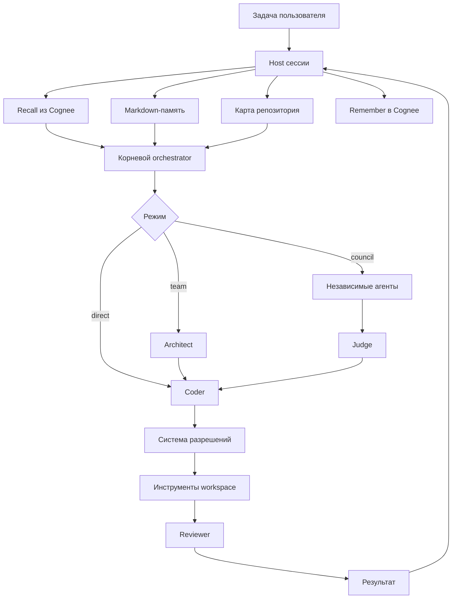

<div align="center">
  <h1>Jevio Fuse</h1>
  <h3>Локальный coding-агент, который помнит устройство вашего проекта</h3>
  <p>Jevio распределяет задачи между специализированными моделями, контролирует изменения<br>через систему разрешений и сохраняет знания с помощью Cognee.</p>
  <p>
    <a href="https://nodejs.org/"></a>
    <a href="https://www.cognee.ai/"></a>
    <a href="#тестирование"></a>
    <a href="LICENSE"></a>
  </p>
  <p><strong>Локальные и облачные модели · долговременная память · мультиагентное ревью · читаемые сессии</strong></p>
</div>

> **Проект для хакатона:** Jevio создан для *The Hangover Part AI: Where's My
> Context?*. Cognee входит в runtime Jevio и реализует полный цикл памяти
> `remember → recall → improve → forget`.

## Зачем нужен Jevio

Большинство coding-агентов теряют знания о проекте после завершения чата.
Длинные диалоги дорого передавать повторно, логи инструментов загрязняют
контекст, а несколько моделей с правом записи создают конфликты.

| Проблема | Решение Jevio |
| --- | --- |
| Решения исчезают между сессиями | Семантическая память Cognee на уровне проекта |
| Диалог переполняет контекст | Компактизация с читаемыми checkpoint-записями |
| Агенты конфликтуют при записи | Параллельный read-only анализ и один writer |
| Модели повторно изучают код | Кэшируемый индекс символов и карта репозитория |
| Инструменты выходят за границы | Проверка workspace и система разрешений host |
| Историю трудно проверить | Markdown-транскрипты в `.jevio/sessions/` |

## Что уже работает

- Интерактивный TUI со streaming-выводом рассуждений и действий.
- Возобновляемые и разветвляемые Markdown-сессии.
- Роли orchestrator, architect, coder, reviewer, judge и compactor.
- Режимы direct, orchestrated, team, council-plan и council-review.
- OpenAI-совместимые Chat Completions и Responses transports.
- Ollama, LM Studio, vLLM, OpenRouter, NVIDIA, OpenAI и совместимые API.
- Чтение, поиск, редактирование, shell-команды и просмотр Git diff.
- Agent Skills из `.agents/skills/*/SKILL.md`.
- Индекс символов с опциональным ускорением Universal Ctags.
- Markdown-память и семантический recall через Cognee.
- Явное подтверждение планов, записи файлов и shell-команд.

## Как это устроено



Модель не является границей безопасности. Файлы, запись, shell-команды,
делегирование и границы workspace контролирует host.

## Жизненный цикл памяти Cognee

Cognee — семантический слой поверх проверяемой Markdown-памяти. Текущая задача
и состояние репозитория всегда приоритетнее извлечённой истории.

| Этап | Когда | Действие |
| --- | --- | --- |
| **Remember** | После успешной задачи, явной записи или компактизации | Сохраняет краткий Markdown без tool trace |
| **Recall** | Перед задачей | Извлекает контекст из dataset проекта как недоверенную историю |
| **Improve** | По `/memory improve` | Обогащает граф; поддерживает legacy `memify` |
| **Forget** | После `/memory clear` | Удаляет только dataset текущего проекта |

Сбой Cognee приводит к предупреждению, но не останавливает задачу и сохранение
локальной сессии.

### Границы памяти

- `.jevio/MEMORY.md` — пользовательские инструкции проекта.
- `.jevio/sessions/*.md` — читаемые диалоги.
- Cognee — семантическая история в отдельном dataset.
- Извлечённая память считается данными, а не инструкцией.
- API-ключи хранятся в окружении или игнорируемых локальных файлах.

## Быстрый старт

Требуются Node.js 22.19+, Git и OpenAI-совместимый endpoint модели.

```bash
git clone https://github.com/theJorDea/JevioFuseHack.git
cd JevioFuseHack
npm ci
node src/cli.ts setup
node src/cli.ts doctor
node src/cli.ts
```

Одноразовая задача и глобальная установка:

```bash
node src/cli.ts "добавь тесты для парсера конфигурации"
npm install -g .
jevio doctor
```

## Настройка провайдера модели

В репозитории есть пример для Ollama. Любой OpenAI-совместимый endpoint можно
указать в `jevio.config.json`:

```json
{
  "defaultProvider": "cloud",
  "providers": {
    "cloud": {
      "baseUrl": "https://api.example.com/v1",
      "apiKeyEnv": "MY_LLM_API_KEY",
      "defaultModel": "my-code-model"
    }
  },
  "roles": {
    "orchestrator": { "provider": "cloud", "model": "my-code-model" },
    "coder": { "provider": "cloud", "model": "my-code-model" },
    "architect": { "provider": "cloud", "model": "my-code-model" },
    "reviewer": { "provider": "cloud", "model": "my-code-model" },
    "judge": { "provider": "cloud", "model": "my-code-model" },
    "compactor": { "provider": "cloud", "model": "my-code-model" }
  }
}
```

Для разных ролей можно выбрать разные модели и провайдеры. Секреты не нужно
записывать в отслеживаемую Git-конфигурацию.

## Настройка Cognee

Для Cognee Cloud задайте URL и API-ключ через окружение.

PowerShell:

```powershell
$env:COGNEE_BASE_URL = "https://api.cognee.ai"
$env:COGNEE_API_KEY = "your-api-key"
```

Bash или zsh:

```bash
export COGNEE_BASE_URL="https://api.cognee.ai"
export COGNEE_API_KEY="your-api-key"
```

Включите адаптер в `jevio.config.json`:

```json
{
  "memory": {
    "cognee": {
      "enabled": true,
      "baseUrl": "http://localhost:8000",
      "baseUrlEnv": "COGNEE_BASE_URL",
      "apiKeyEnv": "COGNEE_API_KEY",
      "authMode": "x-api-key",
      "timeoutMs": 60000,
      "maxResults": 6,
      "maxContextCharacters": 8000,
      "maxRememberCharacters": 16000,
      "rememberCompletedTurns": true,
      "rememberCompactions": true
    }
  }
}
```

Если поле `dataset` не задано, Jevio создаёт стабильное уникальное имя из пути
workspace. Это рекомендуемый вариант: знания разных проектов не смешиваются.
Явный `dataset` нужен только для намеренного совместного использования памяти.

Для self-hosted Cognee укажите локальный URL напрямую. Локальный режим может
работать без ключа; при включённой авторизации выберите `authMode: "bearer"` и
передайте токен через `apiKeyEnv`.

## Двухминутная демонстрация для хакатона

1. Выполните `node src/cli.ts doctor` и покажите подключение и dataset Cognee.
2. Запустите Jevio и завершите небольшую задачу в репозитории.
3. Проверяйте `/memory status` до `DATASET_PROCESSING_COMPLETED`.
4. Создайте новую сессию через `/new` и задайте связанную задачу.
5. Покажите событие `recalled relevant Cognee memory` и контекстный ответ.
6. Запустите `/memory improve`, чтобы продемонстрировать обогащение графа.
7. При необходимости покажите удаление через `/memory clear`.

## Режимы выполнения

| Режим | Pipeline | Когда использовать |
| --- | --- | --- |
| `--direct` | coder | Небольшие изменения с минимальной задержкой |
| по умолчанию | orchestrator с динамическим делегированием | Обычные задачи |
| `--team` | architect → coder → reviewer | Обязательное проектирование и ревью |
| `--council-plan` | 3 architect → judge → coder → reviewer | Рискованные архитектурные решения |
| `--council-review` | 3 reviewer → judge | Независимая проверка кода и тестов |

```bash
node src/cli.ts --direct "переименуй helper парсера"
node src/cli.ts --team "отрефактори хранение сессий"
node src/cli.ts --council-plan "перепроектируй маршрутизацию провайдеров"
node src/cli.ts --council-review
```

Council-режимы распараллеливают анализ только для чтения. Право записи получает
один coder, поэтому конфликтующих изменений не возникает.

В `/provider` есть отдельный пресет LM Studio с endpoint `http://localhost:1234/v1`.
Выберите фактически загруженную модель. Для LM Studio по умолчанию используется
`toolMode: "text"`: Fuse не зависит от native function calling конкретного chat
template и выполняет строгий `jevio_tool_calls` JSON через обычные подтверждения.
Режим можно изменить в форме провайдера или конфиге:

    {
      "providers": {
        "lmstudio": {
          "baseUrl": "http://localhost:1234/v1",
          "toolMode": "text"
        }
      }
    }

Доступные режимы: `auto` пробует native tools и принимает текстовый fallback,
`native` передает OpenAI-compatible `tools`, `text` сразу использует переносимый
текстовый протокол. Для моделей LM Studio без надежного function calling выбирайте
`text`.

## Интерактивные команды

### Сессии

```text
/new                  Создать новую сессию
/sessions             Показать список сессий и переключиться
/resume [id]          Возобновить сессию
/title <текст>        Переименовать текущую сессию
/fork                 Создать ветку диалога
/export-md [путь]     Экспортировать Markdown-транскрипт
```

### Память и контекст

```text
/memory               Показать Markdown-память проекта
/memory add <текст>   Добавить долговременную инструкцию
/memory status        Проверить Cognee, dataset и pipeline
/memory sync          Загрузить MEMORY.md в Cognee
/memory improve       Обогатить граф памяти Cognee
/memory clear         Очистить Markdown-память и dataset проекта
/compact [заметка]    Сжать текущий контекст
/compact status       Показать состояние компактизации
```

### Режимы агентов

```text
/direct
/orchestrate
/team
/council-plan
/council-review
```

## Управление контекстом и безопасность

- Полный транскрипт остаётся в Markdown, а compactor создаёт summary.
- Большие и старые tool results удаляются только из контекста модели.
- Пути проверяются на traversal и выход через символические ссылки.
- Запись и shell-команды по умолчанию требуют подтверждения.
- Architect и reviewer не получают изменяющие инструменты.
- Shell-режимы: `off`, `tests-only`, `package-manager` и `full`.
- Историческая память помечается как недоверенная для защиты от prompt injection.

Параметр `--yes` следует использовать только в доверенных репозиториях.

## Тестирование

Офлайн-проверка:

```bash
npm test
npm run check
```

Тест полного жизненного цикла в реальном Cognee Cloud:

```bash
npm run test:cloud
```

Cloud-тест создаёт временный dataset, ждёт индексацию, проверяет recall и improve,
а затем удаляет dataset. Нужны `COGNEE_BASE_URL` и `COGNEE_API_KEY`.

## Структура проекта

```text
bin/                         CLI launcher
src/agent.ts                 Цикл модели и инструментов без состояния
src/cli.ts                   Host сессии и интерактивные команды
src/orchestrator.ts          Team- и council-pipelines
src/memory.ts                REST-адаптер Cognee
src/session.ts               Хранение Markdown-сессий
src/compaction.ts            Компактизация длинного контекста
src/symbol-index.ts          Карта репозитория и поиск символов
src/tools.ts                 Инструменты workspace и система разрешений
src/provider/                Адаптеры transports моделей
src/default-skills/          Встроенные Agent Skills
test/                        Unit- и Cloud integration-тесты
docs/architecture.md         Архитектура и инварианты
```

Подробности: [docs/architecture.md](docs/architecture.md).

## План развития

Подробный [аудит Cognee и исследование интеграций](docs/research-and-integrations.md)
содержит приоритеты, риски и проверяемый план реализации.

- Обратная связь по retrieval и оценка качества памяти.
- Benchmark для решений, workflows и устаревшей памяти.
- MCP-клиент и динамические схемы инструментов.
- Реестр возможностей провайдеров: vision, reasoning и размер контекста.
- Интеграция с редакторами через ACP.
- Точный учёт контекста с tokenizer выбранной модели.

## Источники архитектурных идей

Jevio использует идеи [Kimi Code](https://github.com/MoonshotAI/kimi-code) —
изолированные контексты и читаемые сессии — и
[OpenCode](https://github.com/anomalyco/opencode) — гигиена контекста.
Семантический слой памяти построен на
[Cognee](https://github.com/topoteretes/cognee). Исходный код этих проектов не
копировался.

## Лицензия

[MIT](LICENSE)
