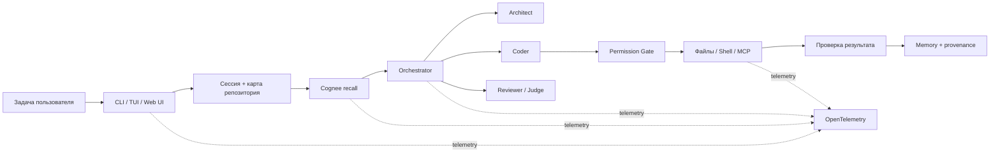

<div align="center">
  <h1>Jevio Fuse</h1>
  <p><strong>Локальный мультиагентный coding-агент с долговременной памятью проекта</strong></p>
  <p>
    Jevio исследует репозиторий, распределяет работу между специализированными ролями,<br>
    контролирует изменения и переносит проверенный контекст между сессиями.
  </p>
  <p>
    <a href="https://github.com/theJorDea/JevioFuseHack/actions/workflows/ci.yml"></a>
    
    
    
    <a href="LICENSE"></a>
  </p>
</div>

## О проекте

Обычный AI-ассистент начинает каждый новый чат почти с нуля. Jevio Fuse сохраняет
важные решения, ограничения и результаты прошлых задач, а затем возвращает только
релевантный контекст. Длинные диалоги автоматически сжимаются, поэтому работа может
продолжаться без переполнения контекстного окна.

Jevio работает **local-first**: CLI, TUI, Web UI, история сессий, Markdown-память,
индекс кода и локальные модели не требуют внешнего сервиса. Семантическую память
[Cognee](https://docs.cognee.ai/core-concepts/overview) можно развернуть локально
или подключить через Cognee Cloud.

Основные возможности:

- пять режимов выполнения — от быстрой правки до архитектурного совета;
- отдельные роли Architect, Coder, Reviewer, Judge и Orchestrator;
- session-aware память Cognee с графом знаний и векторным поиском;
- объяснимый recall: источник, сессия, score, Git SHA, файлы и результаты тестов;
- замена устаревших воспоминаний с физическим удалением старого источника;
- подключение внешних инструментов через MCP;
- единый OpenTelemetry trace от запроса до сохранения результата;
- подтверждение записи файлов, shell-команд и MCP-вызовов на стороне host.

## Как устроен Jevio Fuse



Параллельные специалисты анализируют проект без записи. Изменения выполняет один
Coder, поэтому несколько ролей не перезаписывают одни и те же файлы одновременно.
Модель предлагает действие, но доступ к файловой системе, shell и внешним tools
остаётся под контролем Jevio и пользователя.

## Режимы работы

| Режим | Состав | Когда использовать |
| --- | --- | --- |
| `--direct` | Coder | Небольшая понятная правка |
| по умолчанию | Orchestrator с динамической делегацией | Повседневная разработка |
| `--team` | Architect → Coder → Reviewer | Фича или рефакторинг с обязательной проверкой |
| `--council-plan` | 3 Architect → Judge → Coder → Reviewer | Архитектурная задача с несколькими независимыми решениями |
| `--council-review` | 3 Reviewer → Judge | Независимый аудит готовых изменений |

Дополнительно `/plan` включает read-only планирование: агент может исследовать код,
но не изменит проект до подтверждения плана.

## Технологии и интеграции

| Компонент | Реализация |
| --- | --- |
| Runtime | [Node.js](https://nodejs.org/) 22.19+ и TypeScript |
| Модели | OpenAI-compatible Chat Completions и Responses API |
| Провайдеры | Ollama, LM Studio, NVIDIA NIM, OpenRouter, vLLM и OpenAI |
| Память | Cognee: session cache, vector search, knowledge graph, `remember → recall → improve → forget` |
| Интерфейсы | Интерактивный TUI на `pi-tui`, браузерный UI и SSE streaming |
| Инструменты | Workspace tools, web search/fetch и MCP over stdio |
| Навигация по коду | Universal Ctags с встроенным fallback-индексом |
| Наблюдаемость | OpenTelemetry JS, console exporter и OTLP/HTTP |
| Автоматизация | GitHub Actions, Cloud lifecycle test и memory benchmarks |

## Быстрый старт

Требования: Node.js 22.19+ и хотя бы один OpenAI-совместимый провайдер. Для
полностью локальной работы удобно использовать Ollama или LM Studio.

```bash
git clone https://github.com/theJorDea/JevioFuseHack.git
cd JevioFuseHack
npm ci
cp jevio.config.example.json jevio.config.json
node src/cli.ts setup
node src/cli.ts doctor
node src/cli.ts
```

После публикации пакета те же команды будут доступны через бинарник `jevio`.
Сейчас гарантированный способ запуска из репозитория — `node src/cli.ts`.

Примеры задач:

```bash
# Быстрая локальная правка
node src/cli.ts --direct "добавь валидацию конфигурации"

# Реализация с планом и review
node src/cli.ts --team "отрефактори модуль авторизации и запусти тесты"

# Выбор архитектуры из трёх независимых предложений
node src/cli.ts --council-plan "спроектируй offline-first синхронизацию"

# Аудит текущего изменения
node src/cli.ts --council-review "проверь diff на ошибки безопасности"
```

Web UI запускается отдельно:

```bash
npm run web
# http://127.0.0.1:8787
```

## Практические сценарии

<details>
<summary><strong>1. Полностью локальный coding-агент</strong></summary>

<br>

Запустите Ollama или LM Studio, выполните `setup` и оставьте Cognee выключенным.
Jevio будет хранить сессии и `MEMORY.md` в проекте, строить локальный индекс и
автоматически сжимать историю. При отключённых telemetry, MCP и web tools код и
диалоги остаются на машине.

</details>

<details>
<summary><strong>2. Продолжение работы в новой сессии через Cognee</strong></summary>

<br>

Для Cognee Cloud укажите в `jevio.config.json` имена переменных окружения:

```json
{
  "memory": {
    "cognee": {
      "enabled": true,
      "baseUrlEnv": "COGNEE_BASE_URL",
      "apiKeyEnv": "COGNEE_API_KEY",
      "tenantIdEnv": "COGNEE_TENANT_ID",
      "authMode": "x-api-key",
      "sessionAware": true
    }
  }
}
```

```bash
export COGNEE_BASE_URL="https://your-tenant.aws.cognee.ai"
export COGNEE_API_KEY="your-api-key"
export COGNEE_TENANT_ID="your-tenant-id"
```

Стабильный project ID хранится в `.jevio/project.json`, поэтому память разных
репозиториев не смешивается и не зависит от абсолютного пути к папке.

```text
/memory add Используем Result вместо исключений в domain layer
/new
/memory explain
/memory improve
```

`/memory explain` показывает, какое воспоминание попало в контекст и откуда оно
получено. Если решение устарело, используйте:

```text
/memory replace <record-id> Теперь domain layer использует typed exceptions
```

Jevio создаст связь `supersedes` и удалит старый source из Cognee. Recall также
фильтруется перед передачей модели: актуальный код всегда имеет приоритет над
исторической памятью.

Для локального backend используйте `baseUrl: "http://localhost:8000"`; официальный
способ запуска описан в [Cognee REST API deployment](https://docs.cognee.ai/guides/deploy-rest-api-server).

</details>

<details>
<summary><strong>3. GitHub, базы данных и другие сервисы через MCP</strong></summary>

<br>

Пример с [официальным GitHub MCP Server](https://github.com/github/github-mcp-server)
через Docker:

```json
{
  "plugins": {
    "mcp": {
      "github": {
        "enabled": true,
        "command": "docker",
        "args": [
          "run", "-i", "--rm",
          "-e", "GITHUB_PERSONAL_ACCESS_TOKEN",
          "ghcr.io/github/github-mcp-server"
        ],
        "env": { "GITHUB_PERSONAL_ACCESS_TOKEN": "${GITHUB_TOKEN}" },
        "roles": ["coder", "reviewer"]
      }
    }
  }
}
```

Проверьте подключение командой `node src/cli.ts plugins` или `/plugins`. Все MCP
tools получают отдельный namespace и проходят существующий permission gate — даже
если внешний сервер предлагает модели выполнить действие автоматически.

</details>

<details>
<summary><strong>4. Трассировка задачи через OpenTelemetry</strong></summary>

<br>

Для локального вывода установите `telemetry.enabled: true` и exporter `console`.
Для Jaeger, Grafana Tempo или другого OTLP backend настройте:

```json
{
  "telemetry": {
    "enabled": true,
    "serviceName": "jevio",
    "exporter": "otlp",
    "endpointEnv": "OTEL_EXPORTER_OTLP_ENDPOINT",
    "sampleRatio": 1
  }
}
```

```bash
export OTEL_EXPORTER_OTLP_ENDPOINT="http://localhost:4318/v1/traces"
```

Trace связывает `task → recall → model → tools → tests → remember`. Тексты prompts,
файлов и памяти по умолчанию не экспортируются.

</details>

## Проверка качества

```bash
npm test                         # 152 unit-теста
npm run check                    # синтаксическая проверка CLI
npm run test:cloud               # реальный lifecycle Cognee Cloud
npm run benchmark:memory         # сравнение recall с Cognee off/on
npm run benchmark:memory:check   # quality gate: 20/20, stale errors 0%
npm run benchmark:coding         # задачи через реальную модель
```

Текущий воспроизводимый memory benchmark: **20/20 найденных фактов**, **100% recall
accuracy**, **0% stale-memory errors**. Cloud workflow запускается отдельно, чтобы
unit-тесты не зависели от внешнего tenant и сетевого состояния.

## Безопасность

- Запись файлов, shell и MCP требуют явного подтверждения.
- Workspace guard блокирует path traversal и выход через symlink.
- Извлечённая память считается недоверенным историческим контекстом, а не инструкцией.
- Секреты читаются из environment или локальных ignored-файлов.
- `--yes` / `--yolo` следует включать только в доверенном workspace.

## Идеи и первоисточники

Архитектура Jevio опирается на опубликованные подходы, но реализует их для работы
с реальным репозиторием и контролируемыми side effects:

- [Cognee: architecture and core operations](https://docs.cognee.ai/core-concepts/overview) — сочетание relational provenance, vector search и knowledge graph, а также lifecycle памяти.
- [MemGPT: Towards LLMs as Operating Systems](https://arxiv.org/abs/2310.08560) — иерархическая память и перенос информации между уровнями контекста.
- [Generative Agents](https://arxiv.org/abs/2304.03442) — накопление опыта, динамический recall, reflection и planning.
- [Reflexion](https://arxiv.org/abs/2303.11366) — использование проверяемой обратной связи и эпизодической памяти без дообучения модели.
- [ReAct](https://arxiv.org/abs/2210.03629) — чередование рассуждения и действий с внешними инструментами.
- [Lost in the Middle](https://arxiv.org/abs/2307.03172) — мотивация для retrieval и compaction вместо бесконечного роста prompt.
- [Model Context Protocol: architecture](https://modelcontextprotocol.io/docs/learn/architecture) — единый client-host-server протокол для внешних tools.
- [OpenTelemetry semantic conventions](https://opentelemetry.io/docs/specs/semconv/) — единая модель traces и атрибутов наблюдаемости.

## Проект и документация

Jevio Fuse разрабатывался в Kodik IDE. Модульная архитектура разделяет memory,
agent loop, providers, tools и host, что позволяет независимо расширять провайдеры,
интерфейсы и интеграции.

Подробнее: [архитектура](docs/architecture.md) ·
[исследование и roadmap](docs/research-and-integrations.md).

Лицензия: [MIT](LICENSE).
