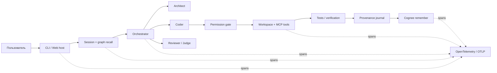

<div align="center">
  <h1>Jevio Fuse</h1>
  <h3>Coding-агент, который помнит проект — и умеет забывать устаревшее</h3>
  <p>
    Локальный AI-агент с мультиагентной оркестрацией, session-aware памятью Cognee,<br>
    проверяемым provenance, permission gate и OpenTelemetry traces.
  </p>
  <p>
    <a href="https://github.com/theJorDea/JevioFuseHack/actions/workflows/ci.yml"></a>
    
    
    
    
    <a href="LICENSE"></a>
  </p>
  <p><strong>Проект для The Hangover Part AI: Where's My Context?</strong></p>
</div>

## Идея за 30 секунд

Обычный coding-агент начинает каждый чат с нуля. Jevio сохраняет проверенные
решения между сессиями, извлекает их перед следующей задачей и показывает, почему
конкретное воспоминание попало в контекст.

Jevio является local-first: CLI, Web UI, TUI, сессии, `MEMORY.md`, permission
gate и модели через Ollama/LM Studio могут работать на машине разработчика без
Cloud. Семантический слой Cognee опционален: его можно поднять локально в Docker
или подключить к Cognee Cloud. Без Cognee агент не ломается — остаются локальные
Markdown-сессии, compaction и долговременные инструкции проекта.

Главное отличие: память не считается абсолютной истиной. Каждая запись связана с
Git SHA, изменёнными файлами, тестами, сессией и remote Cognee IDs. Если решение
устарело, `/memory replace` физически удаляет старый источник из graph/vector
memory и оставляет append-only связь `supersedes` для аудита.

| Доказательство | Результат на реальном Cognee Cloud |
| --- | ---: |
| Полный lifecycle | `remember → indexing → recall → improve → forget` |
| Retrieval benchmark | **20/20** |
| Recall accuracy | **100%** |
| Ошибки устаревшей памяти | **0%** |
| Удаление stale sources | **4/4** |
| Временные datasets после теста | **0** |
| Cloud lifecycle | **31 с** |

## Двухминутная демонстрация

Перед выступлением выполните `npm ci`, настройте Cognee и один раз добавьте
уникальное решение через `/memory add`. Дождитесь
`DATASET_PROCESSING_COMPLETED`, чтобы не тратить сценическое время на холодную
индексацию.

| Время | Действие | Что показать жюри |
| --- | --- | --- |
| 0:00–0:15 | `npm run test:cloud` или готовый CI artifact | Реальный Cloud lifecycle, а не mocks |
| 0:15–0:35 | `node src/cli.ts doctor` | Project ID, отдельный dataset, Cognee и telemetry status |
| 0:35–0:55 | `node src/cli.ts`, затем `/new` и вопрос о прошлом решении | Новая сессия получает память старой |
| 0:55–1:15 | `/memory explain` | Source, dataset, session, score, Git SHA, tests, `dataId` и hash |
| 1:15–1:35 | `/memory replace <id> <новое решение>` | Старый source физически удаляется, история остаётся проверяемой |
| 1:35–1:50 | `/new` и повторный вопрос | Возвращается только актуальная версия |
| 1:50–2:00 | Открыть benchmark artifact и trace | 20/20, 0% stale errors и единая цепочка выполнения |

> **Финальная фраза:** Jevio не просто вспоминает между чатами — он объясняет,
> почему доверился воспоминанию, проверяет его происхождение и умеет безопасно
> отозвать устаревший источник.

## Архитектура



Модель не является границей безопасности. Доступ к workspace, shell, MCP,
подтверждениям и памяти контролирует host.

## Технологии и интеграции

| Компонент | Что используется | Польза |
| --- | --- | --- |
| Долговременная память | Cognee Cloud / self-hosted | Session cache, knowledge graph, semantic recall и granular deletion |
| Наблюдаемость | OpenTelemetry JS, OTLP | Trace `task → recall → model → tools → tests → remember` |
| Инструменты | Model Context Protocol, stdio | GitHub, Linear и другие MCP-серверы через единый permission gate |
| Модели | OpenAI-compatible Chat Completions и Responses | Ollama, LM Studio, OpenAI, OpenRouter, NVIDIA, vLLM |
| Интерфейсы | TUI на `pi-tui`, браузерный Web UI + SSE | Streaming, approvals, сессии, режимы агентов без обязательного frontend-фреймворка |
| Кодовая навигация | Universal Ctags + builtin fallback | Repository map, definitions и symbol lookup |
| Аудит | Markdown + JSONL + Git | Читаемые сессии и provenance без скрытой базы состояния |
| Автоматизация | GitHub Actions | Unit CI и scheduled Cloud memory proof с artifacts |

## Быстрый старт

Требуются Node.js 22.19+ и Git.

```bash
git clone https://github.com/theJorDea/JevioFuseHack.git
cd JevioFuseHack
npm ci
cp jevio.config.example.json jevio.config.json
node src/cli.ts setup
node src/cli.ts doctor
node src/cli.ts
```

Веб-интерфейс:

```bash
npm run web
# http://127.0.0.1:8787
```

Одноразовая задача:

```bash
node src/cli.ts --direct "добавь тесты для parser config"
node src/cli.ts --team "отрефактори memory adapter"
node src/cli.ts --council-plan "перепроектируй систему авторизации"
```

## Подключение Cognee Cloud

Секреты передаются только через окружение:

```bash
export COGNEE_BASE_URL="https://your-tenant.aws.cognee.ai"
export COGNEE_API_KEY="your-api-key"
export COGNEE_TENANT_ID="your-tenant-id"
```

Конфигурация:

```json
{
  "memory": {
    "cognee": {
      "enabled": true,
      "baseUrl": "http://localhost:8000",
      "baseUrlEnv": "COGNEE_BASE_URL",
      "apiKeyEnv": "COGNEE_API_KEY",
      "tenantIdEnv": "COGNEE_TENANT_ID",
      "authMode": "x-api-key",
      "timeoutMs": 60000,
      "sessionAware": true,
      "rememberCompletedTurns": true,
      "rememberCompactions": true
    }
  }
}
```

Не задавайте общий `dataset`, если проекту не нужна намеренно общая память.
Jevio создаёт стабильную identity в `.jevio/project.json`: dataset переживает
перемещение каталога и не смешивается с другими проектами.

Проверка реального Cloud:

```bash
npm run test:cloud
npm run benchmark:memory
npm run benchmark:memory:check
```

Текущий Cognee Cloud иногда возвращает `datasetId` без `dataId` из фонового
`remember`. Jevio автоматически находит data item через dataset API, сопоставляет
filename и подтверждает SHA-256 raw content.

### Полностью локальная семантическая память

Cognee можно запустить рядом с Jevio без передачи проектной памяти в Cognee
Cloud. Провайдер LLM для самого Cognee задаётся в локальном `.env`:

```dotenv
LLM_API_KEY=your-local-or-provider-key
```

```bash
docker run --rm -it --env-file ./.env -p 8000:8000 cognee/cognee:main
```

В `jevio.config.json` оставьте `baseUrl: "http://localhost:8000"` и уберите
`baseUrlEnv`, `apiKeyEnv` и `tenantIdEnv`. Если локальный Cognee настроен на
локальную LLM, весь контур памяти остаётся на машине пользователя.

## Работа с памятью

```text
/memory add <текст>                 Добавить проверенное решение
/memory status                      Проверить dataset и pipeline
/memory explain                     Объяснить последний recall и provenance
/memory replace <record-id> <текст> Физически отозвать старый source и записать новый
/memory improve                     Перенести session cache в постоянный граф
/memory sync                        Синхронизировать MEMORY.md
/memory clear                       Удалить память только текущего проекта
```

Локальные слои:

```text
.jevio/MEMORY.md          Читаемая память проекта
.jevio/memory-log.jsonl   Append-only provenance и remote receipts
.jevio/project.json       Стабильная identity проекта
.jevio/sessions/*.md      Возобновляемые транскрипты
```

Recall считается недоверенной историей. Текущая задача и актуальный код всегда
имеют более высокий приоритет.

## OpenTelemetry

Jevio создаёт spans без prompts, file contents и API-ключей:

```text
jevio.task
├── jevio.memory.cognee.http
├── jevio.model.request
├── jevio.tool.call
├── jevio.verification (event)
└── jevio.memory.cognee.http
```

Локальный console exporter:

```json
{
  "telemetry": {
    "enabled": true,
    "serviceName": "jevio",
    "exporter": "console",
    "sampleRatio": 1
  }
}
```

OTLP Collector, Jaeger или совместимый backend:

```bash
export OTEL_EXPORTER_OTLP_ENDPOINT="http://localhost:4318/v1/traces"
```

```json
{
  "telemetry": {
    "enabled": true,
    "serviceName": "jevio",
    "exporter": "otlp",
    "endpointEnv": "OTEL_EXPORTER_OTLP_ENDPOINT",
    "sampleRatio": 1
  }
}
```

В spans доступны provider/model, role, mode, latency, model turns, tool calls,
output size, token usage (если провайдер её возвращает), verification exit codes,
Cognee routes/status и project/session IDs.

## MCP-интеграции

MCP tools работают через тот же permission gate, что и встроенные инструменты.
Серверы выключены по умолчанию, tools получают namespace
`mcp_<server>_<tool>`.

```json
{
  "plugins": {
    "mcp": {
      "github": {
        "enabled": true,
        "command": "npx",
        "args": ["-y", "@modelcontextprotocol/server-github"],
        "env": {
          "GITHUB_PERSONAL_ACCESS_TOKEN": "${GITHUB_TOKEN}"
        },
        "roles": ["coder", "reviewer"],
        "startupTimeoutMs": 10000
      }
    }
  }
}
```

```bash
node src/cli.ts plugins
# или /plugins внутри сессии
```

Не включайте `autoApprovePlugins` для недоверенного MCP-сервера.

## Режимы агентов

| Режим | Pipeline | Когда использовать |
| --- | --- | --- |
| `direct` | coder | Небольшая локальная правка |
| `orchestrate` | root с динамической делегацией | Обычная задача |
| `team` | architect → coder → reviewer | Изменение с обязательным review |
| `council-plan` | 3 architect → judge → coder → reviewer | Рискованная архитектура |
| `council-review` | 3 reviewer → judge | Независимый аудит diff |

Параллельные специалисты анализируют только для чтения. Единственный writer
предотвращает конфликтующие изменения.

Основных режимов пять. Внутренняя команда `/plan` дополнительно включает
read-only исследование до явного подтверждения плана, но не считается отдельным
основным pipeline продукта.

## Основной пользовательский сценарий

Разработчик запускает Jevio в папке проекта и формулирует задачу естественным
языком. Host извлекает прошлый контекст из Cognee, загружает локальную память и
строит актуальную карту репозитория. В зависимости от выбранного режима задача
идёт напрямую Coder либо распределяется между Architect, Coder, Reviewer и
Judge. Перед записью файлов, shell-командой или MCP side effect Jevio запрашивает
подтверждение, если не включён YOLO. После успешного результата host сохраняет
проверенный итог, Git/test provenance и session ID для следующих разговоров.

## Разработка в Kodik

Jevio Fuse активно разрабатывался в Kodik IDE. AI-возможности среды использовались
для проектирования модульной архитектуры, интеграции с Cognee, рефакторинга и
создания тестового покрытия. Текущий offline suite содержит 158 unit-тестов плюс
отдельный реальный Cognee Cloud lifecycle test. Архитектура отделяет memory,
agent loop, providers и host, поэтому проект подготовлен к будущей упаковке в
экосистему Kodik как плагин долговременной памяти для проектов.

## Benchmarks

### Retrieval memory benchmark

```bash
npm run benchmark:memory
npm run benchmark:memory:check
```

20 сценариев проверяют решения, команды, ограничения и четыре stale sources.
Quality gate требует 20/20, recall accuracy 100%, stale errors 0% и минимум четыре
granular deletions. JSON/Markdown сохраняются в `benchmark/results/`.

### End-to-end coding benchmark

Harness создаёт чистые репозитории, запускает Jevio в режимах Cognee off/on и
проверяет фактические изменения файлов. Значения решений скрыты в памяти и не
присутствуют в пользовательской задаче.

```bash
export JEVIO_BENCH_BASE_URL="https://model.example/v1"
export JEVIO_BENCH_API_KEY="model-api-key"
export JEVIO_BENCH_MODEL="code-model"
export JEVIO_BENCH_TOOL_MODE="auto"

npm run benchmark:coding
```

Для Cognee-on используются те же `COGNEE_*` переменные. Каждый временный dataset
и workspace удаляется в `finally`.

## GitHub Actions

- `CI` запускает `npm ci`, 158 unit-тестов и syntax check на push/PR.
- `Cognee Cloud memory proof` запускается вручную и каждый понедельник.
- Cloud workflow публикует benchmark artifacts и блокирует регрессии памяти.

Добавьте repository secrets:

```text
COGNEE_BASE_URL
COGNEE_API_KEY
COGNEE_TENANT_ID
```

Workflow не запускается на каждом PR, поэтому secrets не передаются коду из
недоверенных forks и не расходуют Cloud quota без необходимости.

## Безопасность

- Workspace paths проверяются на traversal и выход через symlink.
- Запись файлов, shell и MCP требуют подтверждения.
- Режимы shell: `off`, `tests-only`, `package-manager`, `full`.
- Architect и reviewer не получают изменяющие инструменты.
- API-ключи находятся в environment или игнорируемых локальных файлах.
- Recall не может переопределить текущую задачу или актуальный код.
- `/memory clear` удаляет только dataset текущего проекта.
- `--yes` / `--yolo` следует использовать только в доверенном workspace.

## Проверки

```bash
npm test
npm run check
npm run test:cloud              # нужны COGNEE_* secrets
npm run benchmark:memory
npm run benchmark:memory:check
```

## Структура

```text
src/agent.ts                 Цикл model → tools
src/orchestrator.ts          Team и council pipelines
src/memory.ts                Cognee REST adapter
src/memory-journal.ts        Provenance и remote receipts
src/telemetry.ts             OpenTelemetry SDK и spans
src/mcp.ts                   MCP stdio client
src/tools.ts                 Workspace tools и permission gate
src/session.ts               Markdown sessions и memory
src/symbol-index.ts          Ctags/builtin code index
src/web-host.ts              Web session host
scripts/memory-benchmark.mjs Retrieval benchmark
scripts/coding-benchmark.mjs End-to-end coding benchmark
.github/workflows/           Unit CI и Cloud proof
```

Подробные инварианты: [docs/architecture.md](docs/architecture.md). Исследование
и roadmap: [docs/research-and-integrations.md](docs/research-and-integrations.md).

## Следующие шаги

1. Authentication, project membership и private user memory.
2. MCP HTTP transport и OAuth 2.1.
3. Docker sandbox backend для выполнения команд.
4. Tree-sitter/SCIP code intelligence.
5. ACP server для IDE.

---

<div align="center">
  <strong>Jevio Fuse — контекст, который переживает чат и остаётся проверяемым.</strong>
</div>
