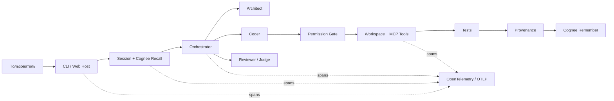

<div align="center">
  <h1>Jevio Fuse</h1>
  <h3>Локальный мультиагентный coding-агент, который помнит проект</h3>
  <p>
    Долговременная память Cognee · 5 режимов работы · Permission Gate<br>
    OpenTelemetry · MCP · Web UI + TUI
  </p>
  <p>
    <a href="https://github.com/theJorDea/JevioFuseHack/actions/workflows/ci.yml"></a>
    
    
    
    
    <a href="LICENSE"></a>
  </p>
  <p><strong>Проект для The Hangover Part AI: Where's My Context?</strong></p>
</div>

## Что это за продукт

Jevio Fuse решает проблему «амнезии» AI-ассистентов: сохраняет проверенные
решения между чатами, автоматически сжимает длинную историю и не допускает
конфликтующих записей нескольких агентов.

Jevio — **local-first**. CLI, Web UI, TUI, модели через Ollama/LM Studio,
Markdown-сессии, `MEMORY.md` и permission gate могут работать полностью локально.
Семантический слой Cognee опционален: локальный Docker или Cognee Cloud. Без
Cognee остаются локальная память, история и compaction.

Главная особенность — память проверяема. Запись содержит Git SHA, session ID,
изменённые файлы, результаты тестов и remote Cognee IDs. `/memory replace`
физически удаляет устаревший source из graph/vector storage и сохраняет
append-only связь `supersedes`.

| Проверка на реальном Cognee Cloud | Результат |
| --- | ---: |
| Lifecycle `remember → recall → improve → forget` | пройден |
| Retrieval benchmark | **20/20** |
| Recall accuracy | **100%** |
| Stale-memory errors | **0%** |
| Физически удалено stale sources | **4/4** |
| Временных datasets после теста | **0** |

## Демонстрация за 2–3 минуты

До выступления добавьте уникальный факт через `/memory add` и дождитесь
`DATASET_PROCESSING_COMPLETED`.

| Время | Действие | Что видит жюри |
| --- | --- | --- |
| 0:00–0:20 | `node src/cli.ts doctor` | Project ID, отдельный dataset, Cognee и telemetry status |
| 0:20–0:45 | Запустить Jevio, `/new`, спросить о прошлом решении | Контекст переносится в новую сессию |
| 0:45–1:10 | `/memory explain` | Source, session, score, Git SHA, tests, `dataId` и hash |
| 1:10–1:35 | `/memory replace <id> <новый факт>` | Старый source физически удаляется |
| 1:35–2:00 | `/new` и повторить вопрос | Возвращается только актуальная версия |
| 2:00–2:30 | Показать benchmark artifact и trace | 20/20, 0% stale errors, полный task trace |

> **Jevio не просто вспоминает между чатами — он объясняет, почему доверился
> воспоминанию, и умеет безопасно отозвать устаревший источник.**

## Как это работает



Модель не является границей безопасности. Пути, shell, MCP, запись файлов и
подтверждения контролирует host. Параллельные специалисты работают read-only;
единственный Coder получает право записи.

## Пять режимов работы

| Режим | Pipeline | Для чего |
| --- | --- | --- |
| `--direct` | Coder | Быстрые небольшие правки |
| по умолчанию | Orchestrator + динамическая делегация | Обычные задачи |
| `--team` | Architect → Coder → Reviewer | Планирование и обязательное review |
| `--council-plan` | 3 Architect → Judge → Coder → Reviewer | Сложная архитектура |
| `--council-review` | 3 Reviewer → Judge | Независимая проверка diff |

`/plan` — вспомогательный read-only этап до подтверждения, а не шестой основной
pipeline.

## Технологии и интеграции

| Область | Технологии |
| --- | --- |
| Runtime | Node.js 22.19+ / TypeScript |
| Память | Cognee session cache, knowledge graph, vector search, granular delete |
| Модели | OpenAI-compatible Chat Completions и Responses |
| Провайдеры | Ollama, LM Studio, NVIDIA NIM, OpenRouter, vLLM, OpenAI |
| Интерфейсы | Интерактивный TUI на `pi-tui`, браузерный Web UI, SSE streaming |
| Инструменты | MCP stdio, встроенные workspace tools, permission gate |
| Наблюдаемость | OpenTelemetry JS, console/OTLP exporters |
| Кодовая навигация | Universal Ctags + builtin fallback |
| CI | GitHub Actions, Cloud lifecycle и benchmark quality gate |

## Быстрый старт

```bash
git clone https://github.com/theJorDea/JevioFuseHack.git
cd JevioFuseHack
npm ci
cp jevio.config.example.json jevio.config.json
node src/cli.ts setup
node src/cli.ts doctor
node src/cli.ts
```

Web UI:

```bash
npm run web
# http://127.0.0.1:8787
```

Одноразовые задачи:

```bash
node src/cli.ts --direct "исправь parser config"
node src/cli.ts --team "отрефактори memory adapter"
node src/cli.ts --council-plan "спроектируй авторизацию"
```

## Память Cognee

Cloud secrets задаются только через окружение:

```bash
export COGNEE_BASE_URL="https://your-tenant.aws.cognee.ai"
export COGNEE_API_KEY="your-api-key"
export COGNEE_TENANT_ID="your-tenant-id"
```

```json
{
  "memory": {
    "cognee": {
      "enabled": true,
      "baseUrl": "http://localhost:8000",
      "baseUrlEnv": "COGNEE_BASE_URL",
      "apiKeyEnv": "COGNEE_API_KEY",
      "tenantIdEnv": "COGNEE_TENANT_ID",
      "authMode": "x-api-key",
      "timeoutMs": 60000,
      "sessionAware": true
    }
  }
}
```

Полностью локальный Cognee:

```bash
docker run --rm -it --env-file ./.env -p 8000:8000 cognee/cognee:main
```

Для локального режима оставьте `baseUrl: "http://localhost:8000"` и уберите
`baseUrlEnv`, `apiKeyEnv`, `tenantIdEnv`. Если Cognee использует локальную LLM,
контур памяти не покидает машину.

Команды памяти:

```text
/memory add <текст>                 Добавить решение
/memory status                      Проверить dataset/pipeline
/memory explain                     Показать recall и provenance
/memory replace <record-id> <текст> Заменить устаревший source
/memory improve                     Перенести session cache в граф
/memory clear                       Удалить память текущего проекта
```

Jevio создаёт стабильную project identity в `.jevio/project.json`. Не задавайте
общий dataset, если вам не нужна намеренно общая командная память.

## OpenTelemetry и MCP

Trace охватывает `task → recall → model → tools → tests → remember`. Prompts,
содержимое файлов, memory text и секреты не экспортируются.

```json
{
  "telemetry": {
    "enabled": true,
    "serviceName": "jevio",
    "exporter": "otlp",
    "endpointEnv": "OTEL_EXPORTER_OTLP_ENDPOINT",
    "sampleRatio": 1
  }
}
```

```bash
export OTEL_EXPORTER_OTLP_ENDPOINT="http://localhost:4318/v1/traces"
```

MCP-серверы выключены по умолчанию. Их tools получают namespace
`mcp_<server>_<tool>` и проходят тот же permission gate:

```json
{
  "plugins": {
    "mcp": {
      "github": {
        "enabled": true,
        "command": "npx",
        "args": ["-y", "@modelcontextprotocol/server-github"],
        "env": { "GITHUB_PERSONAL_ACCESS_TOKEN": "${GITHUB_TOKEN}" },
        "roles": ["coder", "reviewer"]
      }
    }
  }
}
```

## Пользовательский сценарий

Разработчик запускает Jevio в проекте и ставит задачу естественным языком. Host
извлекает прошлый контекст, строит карту репозитория и выбирает pipeline.
Architect планирует, Coder пишет код, Reviewer проверяет; конкретные роли зависят
от режима. Перед side effect Jevio запрашивает подтверждение, если не включён
YOLO. После успеха сохраняются результат, session ID и Git/test provenance.

## Benchmarks и CI

```bash
npm test                         # 152 unit-теста
npm run check
npm run test:cloud              # отдельный реальный Cloud test
npm run benchmark:memory        # retrieval off/on
npm run benchmark:memory:check  # gate 20/20 и 0% stale errors
npm run benchmark:coding        # coding fixtures через реальную модель
```

GitHub Actions запускает unit CI на push/PR. Отдельный manual/scheduled workflow
проверяет Cognee lifecycle, benchmark и публикует JSON/Markdown artifacts. Для
него нужны repository secrets `COGNEE_BASE_URL`, `COGNEE_API_KEY`,
`COGNEE_TENANT_ID`.

## Разработка в Kodik

Jevio Fuse разрабатывался в Kodik IDE. AI-возможности среды помогли спроектировать
архитектуру Cognee, провести рефакторинг и создать тестовое покрытие. Модули
memory, agent loop, providers и host разделены с расчётом на будущую интеграцию в
экосистему Kodik как плагина долговременной памяти для проектов.

## Безопасность

- Workspace защищён от traversal и выхода через symlink.
- Запись, shell и MCP требуют host approval.
- Recall считается недоверенной историей; актуальный код приоритетнее.
- API-ключи хранятся в environment или ignored-файлах.
- `/memory clear` ограничен dataset текущего проекта.
- `--yes` / YOLO предназначен только для доверенных workspace.

Подробности: [архитектура](docs/architecture.md) ·
[исследование и roadmap](docs/research-and-integrations.md).

---

<div align="center">
  <strong>Jevio Fuse — контекст, который переживает чат и остаётся проверяемым.</strong>
</div>
