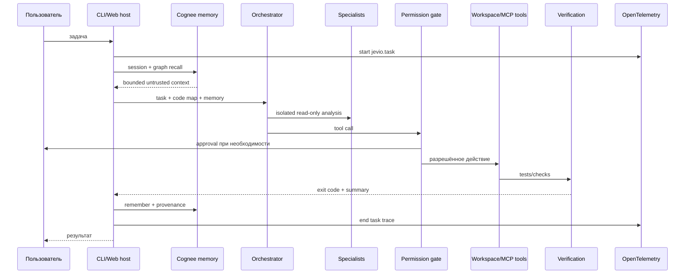

# Архитектура Jevio Fuse

Документ фиксирует текущее устройство и инварианты runtime. Пользовательская
презентация и команды запуска находятся в [README](../README.md).

## Поток задачи



## Границы компонентов

### Session host

`src/cli.ts` и `src/web-host.ts` владеют жизненным циклом задачи: активной
сессией, recall, режимом выполнения, подтверждениями, verification records,
записью результата и telemetry root span.

Сессии сохраняются в `.jevio/sessions/*.md`. Сырой tool trace туда не попадает:
resume загружает только пользовательские сообщения, ответы и последний
compaction checkpoint.

### Agent loop

`src/agent.ts` является stateless циклом `model → tool calls → tool results`.
Он создаёт spans модельных запросов и tool calls, но не управляет сессиями или
постоянным хранением.

Роли:

- `orchestrator` выбирает стратегию и делегирует;
- `architect` исследует и проектирует без write tools;
- `coder` является единственным writer;
- `reviewer` проверяет diff и риски;
- `judge` объединяет независимые решения;
- `compactor` сжимает контекст.

### Orchestrator

`src/orchestrator.ts` реализует direct, team и council pipelines. Параллельность
разрешена только для независимого read-only анализа. Между специалистами
передаются задачи и итоговые отчёты, а не внутренний tool trace.

### Providers

`src/provider/openai-compatible.ts` поддерживает Chat Completions и Responses
API, streaming reasoning, native tools и переносимый text-tool fallback. Usage,
если её возвращает provider, нормализуется в input/output/total tokens и
передаётся в model span.

### Tools и MCP

`src/tools.ts` содержит schemas и host-side исполнение. Проверка workspace,
symlink/traversal, shell policy и approvals выполняется до side effect.

`src/mcp.ts` реализует stdio lifecycle, `tools/list` с pagination и `tools/call`.
MCP tools получают namespace и проходят тот же permission gate. Annotations
внешнего сервера считаются недоверенными metadata.

## Память Cognee

### Project identity

`src/project-identity.ts` атомарно создаёт `.jevio/project.json` со случайным
project ID и закреплённым dataset. После переноса каталога identity сохраняется.
Явный `memory.cognee.dataset` нужен только для намеренно общей памяти.

### Lifecycle

`src/memory.ts` реализует:

```text
remember → indexing → session/graph recall → improve → forget
```

Session recall и dataset-scoped graph recall объединяются, дедуплицируются и
ограничиваются `maxResults`/`maxContextCharacters`. Полученный текст помечается
как недоверенная история; актуальный код и текущая задача приоритетнее.

Для безопасных операций Cognee используются ограниченные retries с
`Retry-After`, exponential backoff и jitter на `429/502/503/504`. Permanent
`remember` автоматически не повторяется, потому что повтор может создать
дубликат source.

### Provenance и замена

`src/memory-journal.ts` хранит append-only `.jevio/memory-log.jsonl`:

- project/session/record ID;
- timestamp и repository HEAD;
- изменённые пути;
- реальные verification commands и exit codes;
- `supersedes`;
- Cognee `datasetId`, `dataId`, `entryId`, pipeline run и content hashes.

Если Cloud `remember` возвращает `datasetId` без `dataId`, адаптер опрашивает
dataset data API, сопоставляет filename и подтверждает SHA-256 raw content.

`/memory replace` удаляет старый Cognee source из graph/vector storage, пишет
новую append-only запись и физически заменяет явный текст в `MEMORY.md`.
Tombstone/record-ID фильтр остаётся fallback для legacy-записей.

## OpenTelemetry

`src/telemetry.ts` регистрирует минимальный Node tracer provider. Доступны console
и OTLP HTTP exporters, sampling и graceful shutdown.

Основные spans/events:

```text
jevio.task
├── jevio.memory.cognee.http
├── jevio.model.request
├── jevio.tool.call
├── jevio.verification (event)
└── jevio.memory.cognee.http
```

Экспортируются технические attributes: project/session IDs, mode, role,
provider/model, token usage, tool name/output size, HTTP route/status, retries и
verification exit code. Prompts, memory text, file contents и secrets не
экспортируются.

## Code intelligence

`src/symbol-index.ts` строит repository map и symbol lookup. Backend `auto`
использует Universal Ctags, если он доступен, иначе builtin parser. Индекс
read-only, кэшируется и инвалидируется после изменений workspace.

## Context hygiene

`src/compaction.ts` резервирует место до переполнения context window и сохраняет
summary плюс несколько последних сообщений. Старые большие tool results внутри
agent turn заменяются маркерами с сохранением tool-call identity.

## CI и benchmarks

- `.github/workflows/ci.yml` проверяет каждый push/PR.
- `.github/workflows/cognee-cloud.yml` вручную и по расписанию запускает реальный
  Cloud lifecycle, retrieval benchmark и quality gate.
- `scripts/memory-benchmark.mjs` сравнивает retrieval Cognee off/on.
- `scripts/coding-benchmark.mjs` запускает реальные coding fixtures off/on через
  настроенный model endpoint.

Временные workspaces и Cloud datasets удаляются через `finally`.

## Инварианты безопасности

1. Модель не является границей безопасности.
2. Side effect выполняется только после host validation и permission gate.
3. Путь нельзя читать или менять за пределами workspace либо через symlink.
4. Architect/reviewer не получают write и shell tools.
5. Только один coder имеет право записи.
6. Tool call всегда получает tool result, включая отказ или ошибку.
7. Recall является данными, а не инструкцией.
8. Недоступность Cognee не прерывает основную задачу и Markdown-сессию.
9. MCP-серверы отключены по умолчанию и не могут сами включить auto-approval.
10. Telemetry не содержит prompts, file contents или secrets.
11. Удаление памяти ограничено dataset текущего проекта.

## Следующие границы

- authentication, project membership и private user memory;
- MCP Streamable HTTP и OAuth 2.1;
- Docker/E2B/Daytona execution backends;
- Tree-sitter и SCIP поверх существующего fallback;
- ACP adapter для редакторов.
